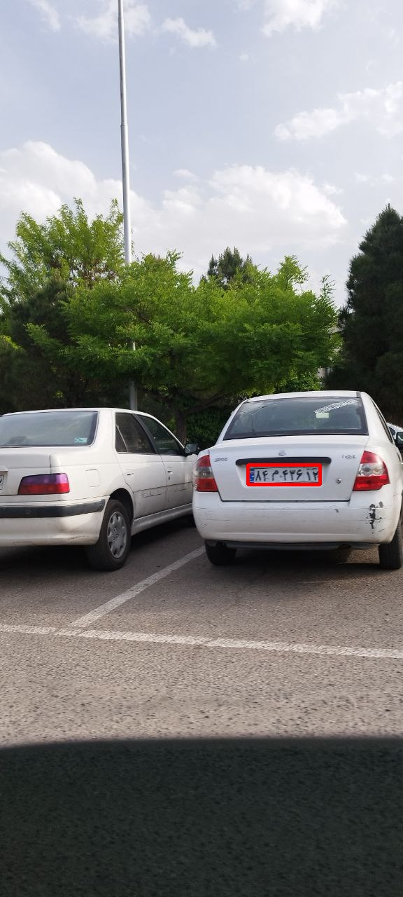

# Persian License Plate Pipeline

This repository provides a pipeline for **License Plate Detection, Recognition, Identification, and Verification** using **YOLOv8** for plate detection and **Deep Text Recognition Benchmark (DTRB)** for character recognition.

## 🚗 Features
- **License Plate Detection** using YOLOv8.
- **Text Recognition** with DTRB for extracted plate images.
- **Identification** of license plate characters.
- **Verification** of plates against a database.

## 📂 Project Structure
```bash
   Persian_License_Plate_Pipeline/
   │── weights/                     # Pretrained model weights
   │── io/                           # Input/output images
   │── DTRB/
   │── identification.py             # Identification module
   │── verification.py               # Verification module
   │── dataset.py                    # Database connection
   │── requirements.txt               # Dependencies
   │── README.md
```
---
### 📌 Results

 **Identification and Verification Persian License Plate**

- Input Image:

  

- Identification Result:

  

- Detected-Cropped License Plate:

  


- Tabel Result:
  |predicted_labels  | confidence score |
  |------------|-------------|
  | 84m43612  | 0.99 |
  
---
### 📌 Resources

Store model weights in the `weights/` directory.

- **📥 Download DTRB Text Recognizer**: [Download Here](https://drive.google.com/file/d/1sX1Y8hVCzn_xK5sAuz5aRrfy0lPqz_9V/view?usp=drive_link) 
- **📥 Download YOLOv8 License Plate Detector**: [Download Here](https://drive.google.com/file/d/16qSjQ58g_F0Zy09-6Ax8AMNLJQrOAWJZ/view?usp=drive_link) 

---

## How to Run the Code
1. Clone the repository:

   ```
   https://github.com/nakhani/Persian_License_Plate_Pipline.git
   ```

2. Navigate to the directory:

   ```
   Persian_License_Plate_Pipline
   ```

3. Install the required packages:
   ```sh
   pip install -r requirements.txt
   ```

4. Run the project:
   ```bash
    python verification.py --detector_weight weights/yolo_detector.pt --recognizer_weight weights/dtrb_recognizer.pth --input_image io/input/image.jpg #For verify License Plate 

    python identification.py --detector_weight weights/yolo_detector.pt --recognizer_weight weights/dtrb_recognizer.pth --input_image io/input/image.jpg  #For identify License Plate 
   ```
---
### Required Inputs:
- --detector_weight: Path to YOLO license plate detection model.
- --recognizer_weight: Path to the DTRB text recognition model.
- --input_image: Path to the license plate image.

### Expected Output:
- Extracted license plate image saved in io/output/.
- Detected license plate text printed to the console.
- Verification status (✅ Verified / ❌ Not Verified).

---
## Technologies Used
- Python 3
- EasyOCR
- NumPy
- Torch
- OpenCV
- Ultralytics YOLOv8
- WarpCTC PyTorch
- LMDB
- NLP & NLTK